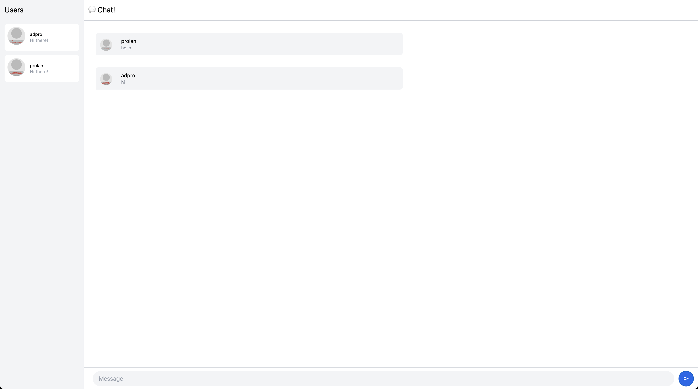
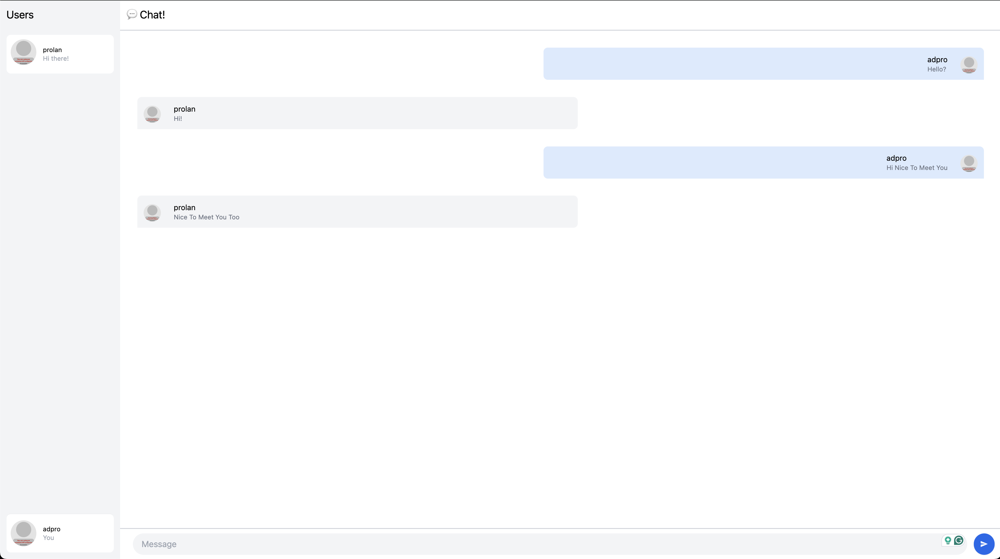

## Experiment 3.1: Original Code

## Experiment 3.2: Modified Code

#### My modification includes:
1. List all other users (not the current user) for room selection on the top left of the page
2. Show the currently logged-in user on the bottom left
3. Chat bubbles:
   - Messages from the current user are right-aligned.
   - Messages from others are left-aligned.